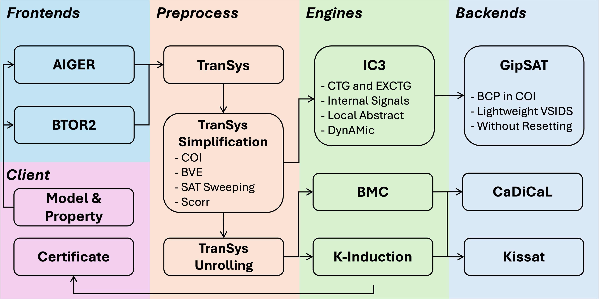

# rIC3 Hardware Model Checker

[](https://www.gnu.org/licenses/gpl-3.0)
[](https://github.com/gipsyh/rIC3/actions/workflows/ci.yml)
[](https://crates.io/crates/rIC3)
[](https://hub.docker.com/r/gipsyh/ric3)

### HWMCC
rIC3 achieved first place in both the bit-level track and the word-level bit-vector track at the 2024 and 2025 Hardware Model Checking Competition ([HWMCC](https://hwmcc.github.io)).

To view the submission for HWMCC'24, please checkout the `HWMCC24` branch or download the binary release at https://github.com/gipsyh/rIC3-HWMCC24.

### Publications
- [CAV2025] [The rIC3 Hardware Model Checker](https://doi.org/10.1007/978-3-031-98668-0_9)
- [CAV2025] [Deeply Optimizing the SAT Solver for the IC3 Algorithm](https://doi.org/10.1007/978-3-031-98668-0_12)
- [DAC2024] [Predicting Lemmas in Generalization of IC3](http://doi.org/10.1145/3649329.3655970)
- [arXiv] [Extended CTG Generalization and Dynamic Adjustment of Generalization Strategies in IC3](https://arxiv.org/abs/2501.02480)

### rIC3 Tool Flow
<p align="center">
	
</p>

### Install From Crates.io
```cargo install rIC3```

### Install From Source
- Install the Rust compiler https://www.rust-lang.org/
- Switch to nightly ```rustup default nightly```
- ```git clone --recurse-submodules https://github.com/gipsyh/rIC3```
- Build ```cd rIC3 && cargo b --release```
- Run ```cargo r --release -- <AIGER FILE>```
- Install ```cargo install --path .```

### Run
- 16-threads Portfolio ```rIC3 <AIGER FILE>```
- single-thread IC3 ```rIC3 -e ic3 <AIGER FILE>```

### Docker
- build image: ```docker build -t ric3 .```
- run: ```docker run -v <AIGER FILE>:/model.aig ric3 model.aig```

### Citation
```
@inproceedings{rIC3,
  author       = {Yuheng Su and
                  Qiusong Yang and
                  Yiwei Ci and
                  Tianjun Bu and
                  Ziyu Huang},
  editor       = {Ruzica Piskac and
                  Zvonimir Rakamaric},
  title        = {The rIC3 Hardware Model Checker},
  booktitle    = {Computer Aided Verification - 37th International Conference, {CAV}
                  2025, Zagreb, Croatia, July 23-25, 2025, Proceedings, Part {I}},
  series       = {Lecture Notes in Computer Science},
  volume       = {15931},
  pages        = {185--199},
  publisher    = {Springer},
  year         = {2025},
  url          = {https://doi.org/10.1007/978-3-031-98668-0\_9},
  doi          = {10.1007/978-3-031-98668-0\_9},
  timestamp    = {Sun, 02 Nov 2025 12:33:32 +0100},
  biburl       = {https://dblp.org/rec/conf/cav/SuYCBH25.bib},
  bibsource    = {dblp computer science bibliography, https://dblp.org}
}
```

Copyright (C) 2023 - Present, Yuheng Su (gipsyh.icu@gmail.com). All rights reserved.
