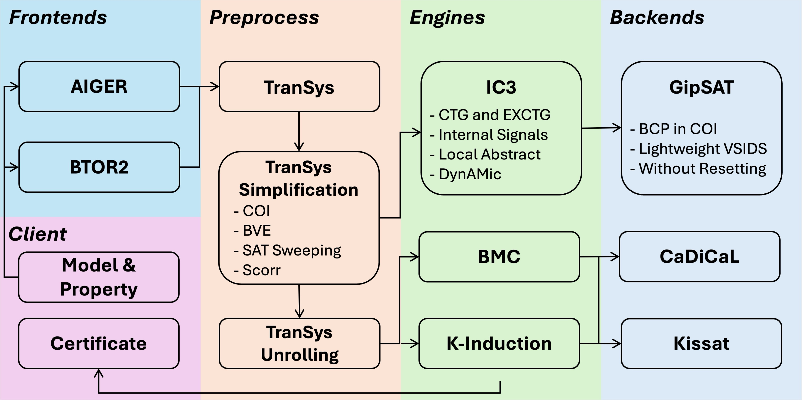

# rIC3 Hardware Model Checker

[](https://www.gnu.org/licenses/gpl-3.0)
[](https://github.com/gipsyh/rIC3/actions/workflows/ci.yml)
[](https://crates.io/crates/rIC3)
[](https://hub.docker.com/r/gipsyh/ric3)

### LLM-Assisted Model Checking
rIC3 supports LLM-accelerated model checking through invariant generation. For details, see the paper [CIll: CTI-Guided Invariant Generation via LLMs for Model Checking](https://arxiv.org/abs/2602.23389).
The prompt and VCD inspection MCP tools are located under the `tools` directory. For a concrete example, see https://github.com/gipsyh/cill-exp

### HWMCC
rIC3 achieved first place in both the bit-level track and the word-level bit-vector track at the 2024 and 2025 Hardware Model Checking Competition ([HWMCC](https://hwmcc.github.io)).


### rIC3 Tool Flow
<p align="center">
	
</p>

### Install From Crates.io
```cargo install rIC3```

### Install From Source
rIC3 can be compiled on both Linux and macOS.

- Install the Rust compiler
- Clone the repository: `git clone --recurse-submodules https://github.com/gipsyh/rIC3`
- Install Bitwuzla from `https://github.com/bitwuzla/bitwuzla` (required by `wlbmc`)
- Install Yosys from `https://github.com/YosysHQ/yosys` and Yosys-Slang from `https://github.com/gipsyh/yosys-slang/tree/ric3` (required by the project-based flow and CIll)
- Build `cd rIC3 && cargo b --release`
- Run `cargo r --release -- check <AIGER/BTOR> portfolio`
- Install `cargo install --path .`

### Usage
- Project-based RTL flow: if your design directory contains a `ric3.toml`, run verification directly from that directory with `ric3 run`.

  ```toml
  [dut]
  # Top-level module name
  top = "counter"
  # RTL source files used to build the DUT
  files = ["counter.sv"]
  # Reset signal name; prefix with "!" for an active-low reset
  reset = "!rst_n"
  ```

  For complete runnable examples, see `examples/`.

- Direct AIG/BTOR checking:
  - 16-threads Portfolio ```ric3 check <AIGER/BTOR> portfolio```
  - single-thread IC3 ```ric3 check <AIGER/BTOR> ic3```

### Docker
- build image: ```docker build -t ric3 .```
- run: ```docker run -v <AIGER/BTOR>:/model.<aig/btor> ric3 check model.<aig/btor> portfolio```

### Publications
- [CAV2025] [The rIC3 Hardware Model Checker](https://doi.org/10.1007/978-3-031-98668-0_9)
- [CAV2025] [Deeply Optimizing the SAT Solver for the IC3 Algorithm](https://doi.org/10.1007/978-3-031-98668-0_12)
- [DAC2024] [Predicting Lemmas in Generalization of IC3](http://doi.org/10.1145/3649329.3655970)
- [arXiv] [Extended CTG Generalization and Dynamic Adjustment of Generalization Strategies in IC3](https://arxiv.org/abs/2501.02480)
- [arXiv] [CIll: CTI-Guided Invariant Generation via LLMs for Model Checking](https://arxiv.org/abs/2602.23389)


Copyright (C) 2023 - Present, Yuheng Su (gipsyh.icu@gmail.com). All rights reserved.
